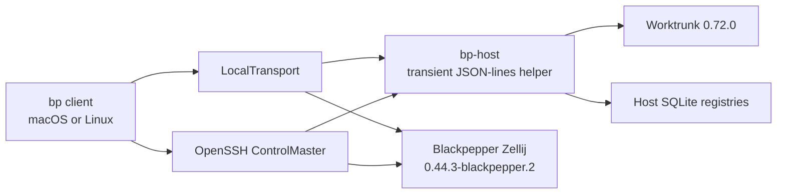

# Blackpepper architecture

Blackpepper V1 is a standalone macOS/Linux TUI that treats a local machine and
a Linux SSH host through one process and PTY boundary. Zellij owns terminal UX
and session persistence; Blackpepper owns workspace discovery, safe actions,
status summaries, and port forwarding.

The decisions and migration consequences are recorded in
[docs/remote-first-v1.md](docs/remote-first-v1.md).

## Runtime shape



`bp` renders a normal `zellij attach` PTY. ANSI bytes flow through
`portable-pty` into the VT100 renderer; keyboard bytes flow back to the same
PTY. SSH therefore transports incremental terminal output, not pixels,
screenshots, or a second terminal protocol.

## Module boundaries

| Area | Source | Responsibility |
| --- | --- | --- |
| Interactive client | `client/` | State, rendering, input modes, command dispatch, host/session lifecycle |
| Configuration | `client_config.rs`, `ssh_config.rs` | Strict layered TOML and explicit SSH alias preview |
| Persisted model | `core/` | Stable UUID types, records, SQLite WAL registry, singleton and repository locks, helper protocol |
| Host execution | `transport/` | Local/SSH exec, PTY attach, forwarding, pinned sidecar download and upload |
| Sessions | `zellij/` | Exact-version checks, attach/create/terminate, tabs and client-safety rules |
| Worktrees | `worktrunk/`, `host_services/worktrunk_exec.rs` | Safe argv construction, schema-2 parsing, approval, mutation lock and outcomes |
| Transient helper | `bin/bp-host.rs`, `host_services/` | Remote registry, repository inspection, ports, agent events and blocker subscriptions |
| Agent status | `providers/`, `agent_status/`, `status_monitor/` | Launch-scoped adapters, normalized state, redacted event store, host-local blocker overlay |
| Ports | `ports/` | Listener parsing, PID/cwd attribution and client-local forward state |

Older tmux-era modules remain in the tree during migration but are not exported
by `lib.rs` and are not part of the V1 binary.

## Identity and persistence

`HostId`, `WorkspaceId`, `RepositoryId`, `SessionId`, `PaneId`, and
`AgentRunId` are UUID-backed identifiers. Names and basenames are labels, not
keys.

A workspace record belongs to exactly one host and one absolute folder. Git
identity is detected as follows:

- A normalized primary network remote groups equivalent HTTPS, SSH, and
  SCP-style URLs without retaining credentials.
- Without a usable remote, the canonical Git common directory is scoped to the
  host identity.
- Non-Git folders remain independent.
- `Ungrouped` persists a per-workspace override.

Each machine stores its authoritative host registry at
`$XDG_STATE_HOME/blackpepper/host-registry.sqlite3`. The remote helper returns
its registry snapshot after a versioned handshake, allowing a second client to
discover folders and sessions previously registered on that host. The client
keeps a local cache for rendering and selection.

SQLite runs in WAL mode with persistent WAL/shared-memory files so transient
background connections cannot replace an inode still held by the interactive
client. XDG state/data directories are private (`0700`) and state files are
`0600`. No private key or terminal content belongs in either registry.

## SSH transport

One foreground OpenSSH ControlMaster is created per connected host inside a
PTY so interactive host-key, password, passphrase, and hardware-key prompts can
be rendered safely.

The master uses the user's normal OpenSSH resolution, including `Include`,
`Match`, agent, keychain, and `ProxyJump`. Child exec, PTY, and forwarding
channels must use the owned control socket. They set `ControlMaster=no`,
`ControlPersist=no`, `ProxyJump=none`, `ProxyCommand=false`, and
`CanonicalizeHostname=no` before config loading. If the master disappears, a
child fails instead of silently opening a new direct connection.

`bp-host` is an exact-version transient executable. Blackpepper prefers an
exact installed helper, otherwise it uploads a packaged Linux build, verifies
its SHA-256 on the host, and atomically installs it under the remote XDG data
directory. It never edits remote shell files or starts a daemon.

## Zellij sessions and concurrency

New sessions require Blackpepper Zellij `0.44.3-blackpepper.2`. The branded
version cannot be satisfied by a binary in `PATH`; Blackpepper uses its
checksum-verified, versioned sidecar. Existing session records retain their
exact runtime, including stock Zellij `0.44.3` or the earlier `.1` generation,
until the workspace is terminated and reopened. Lookup checks a recorded
version's managed path before the current release pin, and sidecars are not
removed while a recorded session may still need them.

Stock session names are `bp-<WorkspaceId>`. Branded sessions append a stable
short hash of the exact Zellij version so they cannot attach to a surviving
stock or older branded server. A workspace attach creates the session in that
workspace folder if needed, then runs ordinary `zellij attach`. Background
agent tabs use a one-pane layout with `focus=false`, an exact cwd, and a
UUID-derived name.

The selected Zellij binary validates the effective configuration with the
read-only `setup --check` command before use. When the workspace host has no
user, environment-selected, or system Zellij configuration, Blackpepper selects
its own versioned appearance file; otherwise native Zellij configuration owns
the entire UI. Blackpepper never rewrites user configuration or injects
keybindings. Each attached client applies the client-local
`on_force_close=detach` override so a configured
`on_force_close "quit"` cannot terminate the persistent session when the
Blackpepper attachment closes.

Several clients may attach. The upstream Zellij 0.44.3 codebase moves a client
when its external API creates a tab even when the layout says `focus=false`.
Blackpepper therefore refuses background service or agent creation with
multiple attached clients; with one client it restores that client's previous
tab immediately after the atomic creation step. Zero-client startup tabs have
no focus owner, so after the first attachment's terminal reader starts, a
bounded host operation takes the same lifecycle lease, revalidates one
unchanged client, and selects shell tab ID 0 before Work-mode input is enabled.
It sends no focus command if the client set changes. Session destruction
requires no attached clients. The sidebar refreshes the live client count every
two seconds. Native Zellij selection remains available. Clients sharing one
pane also share input, scroll/search/selection state, and minimum dimensions.

SSH connection bootstrap/recovery and explicit host operations run outside the
render thread. A generation-tokened worker temporarily owns exactly one host's
transport, helper path, watchers, and local forward resources; unrelated hosts
and attached terminal byte streams continue normally. One explicit operation
is allowed per host, its progress is visible, and `Esc` requests cancellation.
Only the matching generation may merge ownership and registry state back. A
disconnect invalidates and discards the worker result. Worktrunk keeps its
durable unknown-after-dispatch/no-retry rules across cancellation.

Periodic registry, client-count, agent, and listener observation is likewise
coalesced per host and bounded. macOS listener attribution uses one batched
`lsof` query rather than one subprocess per PID.

A source development install exposes only a `bp-dev` launcher. The actual
client and its sibling `bp-host` live in a private directory named by their
exact build identity. That identity is also required by the handshake and
remote helper path, so rebuilding development cannot silently replace or load
the helper owned by a production `bp` install at the same package version.
The identity is a deterministic source-tree hash, allowing unchanged installs
to reuse one verified bundle. Older bundles are never deleted automatically
because live or dormant provider hooks can retain their exact helper paths.

## Worktrunk mutations

Worktrunk 0.72.0 is handled like Zellij: exact installed binary or a verified
sidecar. Blackpepper uses argv, never a shell-composed selector.

- List: schema-2 JSON with branches and remotes.
- Create/open: `wt switch ... --no-cd --format=json`.
- Remove: `wt remove <absolute-path> --foreground --format=json` from a
  surviving worktree.

All mutations first return the exact displayed mutation plus every unapproved
Worktrunk project command and require `:approve`. The opaque approval token is
bound to the canonical repository, exact mutation argv, complete command plan,
and stale approvals. Under one repository advisory lock, the helper rechecks
that plan, drives Worktrunk's interactive persistent approval, verifies what
Worktrunk saved, and only then runs the mutation. Any drift requires another
review. Force, force-delete, clobber, reap, `--yes`, and hook-skipping options
are rejected. A setup hook failure with a created folder is recorded as `Setup
failed`. Transport loss after dispatch becomes `Unknown after disconnect`; the
client does not retry it.

Before any Worktrunk child is allowed to execute, it is placed in a dedicated
Unix process group and registered with a tiny lock guardian. The guardian
inherits the repository lock, survives abrupt `bp-host` or SSH-channel death,
and releases that lock only after the registered child tree has exited or been
terminated. This containment does not cover a trusted project hook that
deliberately daemonizes into a new session/process group; such hooks must not
continue repository mutations after their Worktrunk command returns.

Removal is one host-side transaction boundary. The request carries a stable
workspace ID and expected path; the helper verifies both registered repository
identity and the target/survivor Git common directory. Under the repository
lock it journals an exact removal intent in the host WAL database before
dispatch, then atomically deletes the workspace record after Worktrunk
succeeds. A schema-2 list under that same lock reconciles a surviving intent:
target absent completes the registry delete, target present cancels the intent.
It never invokes remove during reconciliation. The client refreshes the shared
registry after every list, covering both helper crashes and lost successful
responses.

Session lifecycle mutations share a host-owned, workspace-keyed advisory
lease. Session restore, verified client attach, background service/agent tab
creation, detach state, and termination all refresh the host registry while
holding that lease. Approved removal terminates first, then its host helper
takes the same lease and refuses a newly recreated session before journaling
and dispatching Worktrunk. Session acquisition rechecks both workspace
existence and pending-removal state after it owns the lock.

## Agent status and privacy

Each launch receives workspace and run IDs. Provider adapters emit compact
semantic events to `bp-host`; stale or cross-run IDs are rejected. The host
event database stores normalized state, sequence, source, health, and
timestamps transactionally. Hook commands are fail-silent and never persist
prompt, response, command, tool, or terminal text.

Codex and Claude Code receive a non-interactive configuration preflight;
OpenCode has no stable equivalent. After every provider tab starts, the client
waits up to five seconds for its launch-scoped health event and returns guided
setup instructions if the integration is not healthy. A Codex hook-trust
timeout leaves the tab open for an explicit `/hooks` review while deactivating
the unhealthy run; the user closes it and retries after trust. Other unhealthy
provider tabs are cleaned up automatically.

The managed OpenCode plugin also sends a payload-free heartbeat every two
seconds. The host stores only its latest delivery time and records semantic
health edges: ten seconds without delivery becomes `stale`, while the next
successful pulse becomes healthy only if its semantic cursor exactly matches
the host's last committed provider event. A missing, duplicate, or out-of-order
cursor stays stale until a new launch-scoped run starts; later events cannot
skip the gap. The already-running host-local watcher switches to its redacted
blocker match while stale and clears that overlay on recovery; neither the
provider nor the watcher is restarted. The UI reports OpenCode coverage as
**full** only while this health is current, otherwise **partial**.

Provider state is normalized to unknown, ready, working, needs-input, and
exited. A completion revision that a client has not seen is rendered as done.

Pinned blocker manifests, attributed in-tree as adaptations of Herdr's
Apache-2.0 manifests, are evaluated beside Zellij on the workspace host. They
may only add and clear a temporary needs-input overlay. The stream crossing SSH
contains a rule ID, manifest version, confidence, sequence, and timestamp,
never viewport evidence. Screen rules cannot set working/done or send input.

The client starts one cancellable blocker subscription after a provider's
launch-scoped health handshake succeeds and stops it on disconnect or run exit.
For OpenCode, that subscription polls only compact persisted health and retains
only the last matched rule metadata, never viewport text.

After observing a newly created agent pane, the helper persists the exact
session ID/name/version, tab ID/name, and terminal-pane selector. Startup,
reconnect, and periodic reconciliation query those exact fields without focus
changes. A live process is rehydrated with its existing run ID and a watcher;
an exited or missing pane receives a monotonic supervisor `exited` event and is
deactivated. No provider command is relaunched. A supervisor `unknown` event
from Ctrl-C also persists a completion-suppression barrier, so a delayed stop
hook cannot manufacture `done`; later authoritative activity clears it.

## Ports

The transient helper runs `ss` on Linux or `lsof` on macOS and attributes a
listener to the deepest registered workspace whose root contains the process
cwd. Permission or probe gaps return an explicit partial/failed snapshot. The
client refreshes connected hosts every two seconds and shows workspace ports by
default, with an explicit all-host view.

SSH forwards are OpenSSH control operations bound to client `127.0.0.1`. The
remote target retains the discovered listener address as well as its port;
wildcard listeners normalize to the matching address-family loopback. A port
row in Manage mode is clickable; `:forward` provides the same action. A
port-only command fails closed when several interfaces or processes could
match. Initial creation prefers the remote port locally, then chooses a free
port and shows the exact mapping. A manual reconnect recreates the forward on
that exact local and remote endpoint or reports `Port conflict`; it never
selects a new URL silently. The ControlMaster itself is not reconnected
automatically. SSH forwards and local proxies are owned by, and end with, the
client process. A listener already bound to local loopback needs no proxy and
is recorded as a direct URL; cancelling it removes only Blackpepper's shortcut.

## Workspace services and reboot recovery

Creating a workspace session starts one shell. A newly created or recreated
session also creates each `[[startup]]` entry marked `auto_start`; any named
entry can be started explicitly with `:service start`. The initial shell,
service tabs, and provider launches receive `[workspace.env]`; services use
exact argv and cannot set a cwd outside the workspace. Launch-scoped provider
integration values take precedence over project values. On SSH reconnect after
a host reboot, Blackpepper recreates registered shells and configured services,
but never relaunches a provider or claims its conversation resumed.

## Failure rules

- Configuration and protocol schema errors fail visibly; no fallback to
  defaults after a parse failure.
- Separate kernel advisory locks permit one production `bp` and one
  development `bp-dev` client per OS user and report an existing same-channel
  PID. Both channels share the stable host/workspace/session registry and
  lifecycle locks; agent-event databases are channel-specific. Registry model
  changes must remain backward-compatible within the V1 storage epoch.
- Sidecar checksum/version mismatch fails closed.
- SSH child channels cannot bypass a dead ControlMaster.
- Worktrunk mutations are never retried after an ambiguous disconnect; a
  schema-2 list resolves a journaled removal without dispatching another one.
- Port attribution may be partial, but must say so.
- Status heuristics never become authoritative agent state.

## Build and validation

```bash
cargo build -p blackpepper
cargo test --workspace
cargo fmt
cargo clippy --workspace -- -D warnings
```
