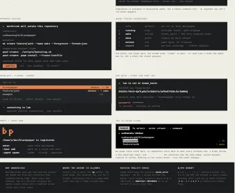

# Blackpepper

```text
█
█▀▄  █▀▄
█▄▀  █▄▀
     █
```

Blackpepper is a remote-first terminal workspace for coding agents. Local
folders and folders on Linux SSH hosts use one interface, while Zellij keeps
shells, services, and agent tabs alive on the machine where the work runs.

## Install

Install the latest published macOS or Linux release:

```bash
curl -fsSL https://sudhanshug16.github.io/blackpepper/install.sh | bash
```

The installer downloads the archive for the current OS and CPU, verifies its
SHA-256, and atomically publishes a versioned bundle under `~/.local/bin` by
default. The bundle contains `bp`, its exact native `bp-host`, and static Linux
x86_64 and arm64 helpers for supported SSH hosts. Set `INSTALL_DIR` to another
absolute directory if required.

For the current source tree, install the development channel beside production:

```bash
git clone https://github.com/sudhanshug16/blackpepper.git
cd blackpepper
./scripts/setup.sh
bp-dev
```

`bp-dev` never replaces production `bp`. One process in each channel may run
for the same OS user; both see the stable workspace/session registry and share
lifecycle locks, while provider-event stores stay channel-specific. A local
development bundle contains only its native helper. Use a published release
for macOS-to-Linux or cross-architecture helper bootstrap.

For a source-watching development loop, run this from the project or workspace
you want Blackpepper to open:

```bash
/path/to/blackpepper/scripts/dev-watch.sh
```

This is a temporary source-run loop rather than in-process hot module loading.
The supervisor is a separate Rust crate; Python and `scripts/setup.sh` are not
involved. It compiles `bp` and `bp-host` directly, stages immutable run bundles
only under `target/`, and never changes `~/.local/bin`, the installed `bp-dev`,
or its retained pre-production bundles. The source run has its own singleton
and provider-event database, so an installed `bp-dev` may keep running; all
channels still share the real workspace registry and lifecycle locks.

A compile failure leaves the current source-run TUI attached and records the
error in `target/blackpepper-dev-watch.log`; a successful build gracefully
detaches it and launches the new target-local bundle. Zellij sessions survive
the relaunch, but transient Manage-mode selection, palette text, and scroll
positions reset. Quit Blackpepper normally to stop the watch loop. Target-local
client executables are removed after they stop; their compact matching helpers
remain available for exact provider-hook paths until `target/` is cleaned.

## First use

Open a local project:

```bash
cd /path/to/project
bp
```

Blackpepper registers the current folder. Press `Enter` to create or attach its
persistent Zellij session. Use `Ctrl+]` to move between the terminal and Manage
mode; quitting Blackpepper detaches without stopping the session.

To add a Linux SSH host, use an existing literal OpenSSH alias:

```text
:host add lab homelab
:host connect lab
:workspace add /srv/projects/example
```

OpenSSH still owns `Include`, `Match`, `ProxyJump`, agents, keychain behavior,
host-key decisions, and password/passphrase/security-key prompts. Blackpepper
relays those prompts and does not store credentials. `:host import` previews
literal positive aliases from `~/.ssh/config`; it does not register them.

Running this native client locally is the recommended SSH boundary. If a
development session instead runs Linux `bp` inside an outer `ssh` command, use
the optional [terminal guard](docs/macos-ssh-pty.md#recommended-ssh-boundary)
so the local caller can restore its terminal after a lost data channel.

Start an agent, create a worktree, or forward a discovered listener:

```text
:agent spawn codex
:worktree create feature/auth --base main
:approve
:ports
:forward 3000
```

Every Worktrunk mutation is previewed first. `:approve` is bound to the exact
repository, argv, and project-hook plan shown on screen; a changed plan needs a
new review. Blackpepper never adds force, clobber, hook-skipping, reap, or
force-delete options.

## Terminal design



*Blackpepper v2 design board (design direction, not a shipped runtime
screenshot).*

The current v2 renderer is borderless and terminal-native: shaded surfaces
replace bright panel boxes, one quiet row anchors each mode, and agent status
uses the words `idle`, `running`, `asks`, `done`, `exited`, and `unsure`. The
board supplied the design direction; it is not evidence that every pictured
interaction is available. See the [v2 design-system
specification](docs/design-system-v2.md) and the [roadmap](docs/roadmap.md) for
the implemented contract and remaining live-acceptance work.

## Runtime model

- A **workspace** is one registered absolute folder on one host.
- Manage mode groups workspaces as **Host → Repository → Workspace**. Git
  worktrees sharing a common directory or normalized primary remote group
  automatically; `:workspace ungroup` persists an exception.
- Every workspace has a UUID-named Zellij session. Detach keeps it alive;
  `:workspace terminate` ends only the session and keeps the folder.
- Agent spawning stays in the selected folder. Worktree creation is a separate,
  explicit Worktrunk action.
- SSH transports a normal `zellij attach` PTY byte stream, not video or
  screenshots. `bp-host` is a transient helper, not a daemon.

Manual SSH reconnect restores registered shells, `auto_start` services, and
forwards on their original local ports. It never resumes an agent conversation.
A lost response after `wt remove` is reconciled by a fresh `:worktree list`;
Blackpepper does not retry the mutation.

## Controls

| Input | Action |
| --- | --- |
| `Ctrl+]` | Toggle terminal and Manage modes |
| `Ctrl+n` | Select and attach the next workspace |
| `Ctrl+\` | Open the workspace switcher |
| `↑` / `↓` | Move the Manage-mode selection |
| `Enter` | Attach the selected workspace |
| `:` | Enter a Blackpepper command |
| `Esc` | Cancel/close the current Blackpepper surface or return to the terminal |
| `q` | Quit from Manage mode; Zellij sessions keep running |
| Click a workspace | Select it |
| Click the Manage-mode session | Enter terminal mode (or attach when detached) |
| Click the terminal-mode status row | Return to Manage mode |
| Click a command/help/picker row | Complete or choose that row |
| Mouse wheel | Scroll or move the panel under the pointer |

Terminal mode gives Zellij the window except for one status row. Other input
passes through unchanged, including Zellij panes, tabs, scrollback search,
selection, and copy. Blackpepper accepts bounded OSC 52 clipboard writes,
never answers clipboard reads, and does not persist clipboard text.

The `:` prompt is a progressive command palette. Type any part of a command
path, use `↑`/`↓` to choose, and press `Tab` or click to complete it. The palette
then names the next argument and offers observed hosts, workspaces, services,
providers, listeners, and active forwards where available. Values containing
spaces are quoted automatically. An incomplete or invalid command stays open
with its usage so it can be corrected in place.

## Commands

These are the commands accepted by the current TUI parser:

| Command | Result |
| --- | --- |
| `:host add <name> <ssh-alias>` | Register one SSH destination alias |
| `:host import` | Preview literal aliases from `~/.ssh/config` |
| `:host connect <name>` | Open the interactive SSH control connection |
| `:host disconnect <name>` | Disconnect; remote sessions remain |
| `:workspace add <path>` | Register an existing folder |
| `:workspace switch <name\|id>` | Select and attach a workspace |
| `:workspace ungroup` | Exclude the workspace from repository grouping |
| `:workspace terminate` | End its Zellij session; keep its folder |
| `:worktree list` | List Worktrunk schema-2 branches/worktrees |
| `:worktree create <branch> [--base <ref>]` | Preview worktree creation |
| `:worktree open <branch\|pr:123\|url>` | Preview opening a Worktrunk target |
| `:worktree remove` | Preview removal of the selected worktree |
| `:agent spawn <codex\|claude\|opencode>` | Start an integrated agent tab |
| `:service start <name>` | Start a configured service tab |
| `:ports [--all-host]` | Discover workspace or host listeners |
| `:forward <port\|address:port>` | Forward one exact listener to client loopback |
| `:forward cancel <port\|address:port>` | Cancel this client's exact forward |
| `:status explain` | Show redacted agent-status diagnostics |
| `:approve` | Run the exact reviewed Worktrunk plan |
| `:refresh` | Refresh hosts, workspaces, agents, and ports |
| `:help` | Show the command reference |
| `:quit` / `:q` | Detach and exit |

There are no parser commands for PR creation/merge, branch renaming, automatic
worktree creation, or agent-conversation restoration. Removing a worktree
currently requires another registered worktree from the repository as
Worktrunk's surviving working directory.

## Platforms and dependencies

| Role | Runtime target |
| --- | --- |
| Client and local workspace | macOS or Linux; x86_64 or arm64 |
| SSH workspace host | Linux; x86_64 or arm64 |
| Session runtime | Blackpepper Zellij **0.44.3-blackpepper.1** (upstream 0.44.3 base) |
| Worktree runtime | Worktrunk **0.72.0** |

The code targets all four client combinations, but the full live macOS/Linux
acceptance matrix is still incomplete. Password and FIDO/security-key prompt
acceptance also remains open; see the [roadmap](docs/roadmap.md).

The client needs system OpenSSH. A workspace host needs a POSIX shell, Git,
`install`, and `sha256sum`; listener discovery needs `ss` on Linux or `lsof` on
a local macOS workspace. Install and authenticate `codex`, `claude`, or
`opencode` on the host where it will run. Blackpepper always uses its branded,
checksum-pinned Zellij sidecar for new sessions rather than satisfying that pin
from `PATH`. Existing stock session records retain Zellij 0.44.3 until their
workspace is terminated and reopened. When exact Worktrunk is unavailable,
Blackpepper similarly downloads and installs its private versioned sidecar.
Neither tool installation edits `PATH` or shell files.

## Configuration

Configuration is strict TOML; unknown fields fail startup. Later layers win:

1. `$XDG_CONFIG_HOME/blackpepper/config.toml`
2. `<workspace>/.blackpepper/config.toml`
3. `<workspace>/.blackpepper/config.local.toml`

Only the user layer may define SSH hosts, and each host contains one OpenSSH
`destination` alias. Workspace layers may define argv-based `[[startup]]`
services and `[workspace.env]`. Example:

```toml
[keymap]
toggle_mode = "ctrl+]"
switch_workspace = "ctrl+n"
workspace_overlay = "ctrl+\\"

[hosts.lab]
destination = "homelab"

[[startup]]
name = "web"
command = ["npm", "run", "dev"]
cwd = "apps/web"
auto_start = true

[workspace.env]
RUST_LOG = "info"

[ui]
background = "#1c1d1f"
foreground = "#e6e4e1"
```

Relative service working directories must remain inside the workspace.
Blackpepper's launch-scoped provider integration values override conflicting
project values without rewriting personal provider configuration.

## Privacy and safety boundaries

- Host-side agent state stores IDs, normalized state, source, health, sequence,
  and timestamps—not prompts, responses, commands, tool content, or terminal
  text.
- Screen rules may add or clear a temporary needs-input hint. They cannot mark
  an agent running/done, send input, persist viewport text, or transmit evidence
  text to the client.
- Port forwards bind only to client loopback. A port-only selector must resolve
  to one exact discovered socket; ambiguous shared/overlapping sockets are
  refused.
- Zellij configuration is checked read-only. When none exists, Blackpepper
  selects its versioned default appearance; any user, environment-selected, or
  system configuration owns Zellij instead. Blackpepper adds no keybindings
  and forces only detach-on-client-close for its attached client.
- Registry and lock directories are private XDG state. Production and
  development share workspace/session coordination but not provider events.

## Development

```bash
cargo build -p blackpepper
cargo test --workspace
cargo fmt
cargo clippy --workspace -- -D warnings
scripts/test-dev-installer.sh
cargo test -p blackpepper-dev-watch
scripts/test-terminal-transparency-e2e.sh
```

For browser inspection, `scripts/web-dev.sh` runs the exact development bundle
inside a one-client, loopback-only ttyd/xterm.js PTY. See the
[browser development guide](docs/web-dev.md). Architecture and invariant detail
lives in [ARCHITECTURE.md](ARCHITECTURE.md); the documentation index is
[docs/README.md](docs/README.md).

## License

Blackpepper is MIT licensed. Release bundles also include Herdr's Apache-2.0
license and attribution for the adapted blocker-only manifests.
