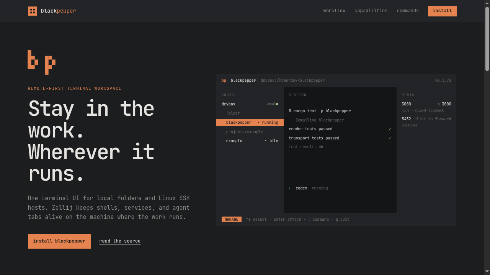
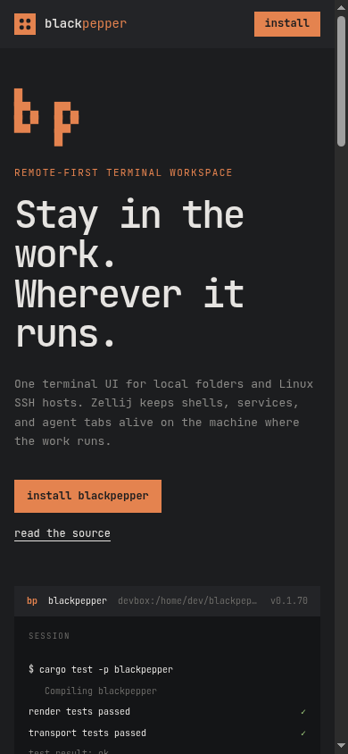

# Blackpepper v2 design QA

**Source of truth:** `Blackpepper - logo & TUI v2.dc.html` from the supplied
`Blackpepper Logo and TUI Design (1).zip` archive.

**Final capture environment:** Chrome for Testing 151, device scale factor 1,
local `docs/index.html`, after the final HTML/CSS change.

## Final website captures

### Desktop — 1280 × 720

SHA-256: `aca5b3fc69d1e0e14a5b2c8624ed59f53b6cdbc6799489d86994d4629f201ca8`

### Mobile — 390 × 844

SHA-256: `1cc4996e4078096eb89d408ff49b3e07e35f5fa284be739209ccbd06514eabd8`

## Comparison with the supplied board

| Check | Result |
| --- | --- |
| Peppercorn, Canvas, Raised surface, and Ink tokens | Match |
| Flat shaded surfaces with no gradients, shadows, outlines, or translucent header | Match |
| Four-row terminal mark and grinder-plate application icon | Match |
| Borderless terminal preview with `HOSTS`, `SESSION`, and `PORTS` shade tiers | Match |
| One Peppercorn selection/accent and quiet secondary text | Match |
| JetBrains Mono typography and compact terminal rhythm | Match |
| Solid sticky header | Match |
| 1280 px desktop composition | Match; product preview stays beside the primary message |
| 390 px mobile composition | Match; host and port rails collapse so the session remains readable |
| Page-level horizontal overflow | None at either captured width |
| Unsupported product data | Removed; no branch, dirty state, PR, tab count, or agent elapsed time is invented |

The website adapts the design board rather than copying its illustrative data.
The terminal preview uses only current, parser-backed commands and state that
Blackpepper can truthfully display. The mobile preview intentionally keeps the
session surface and hides the two management rails; their capabilities remain
documented below the fold.
